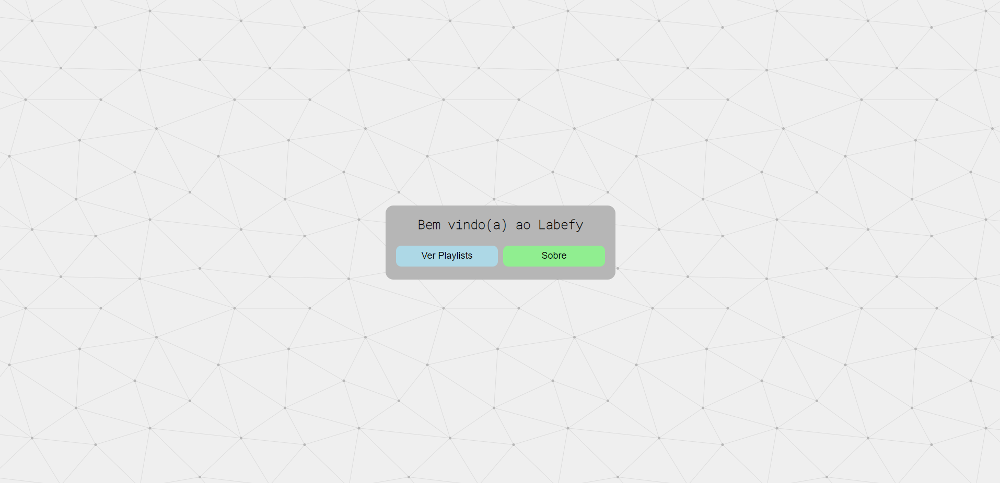
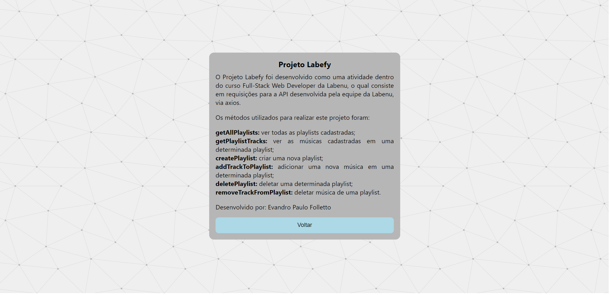
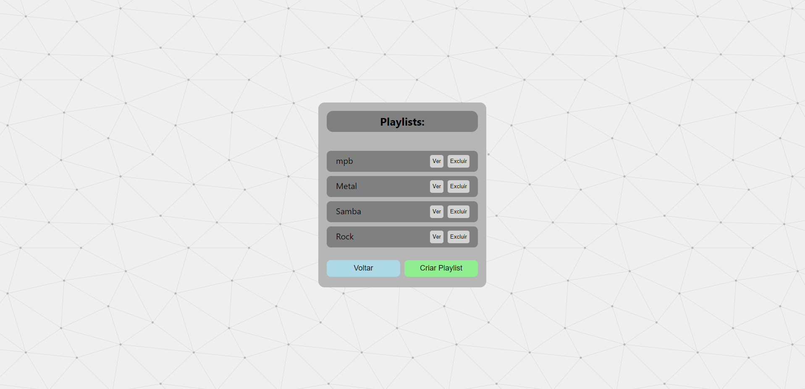
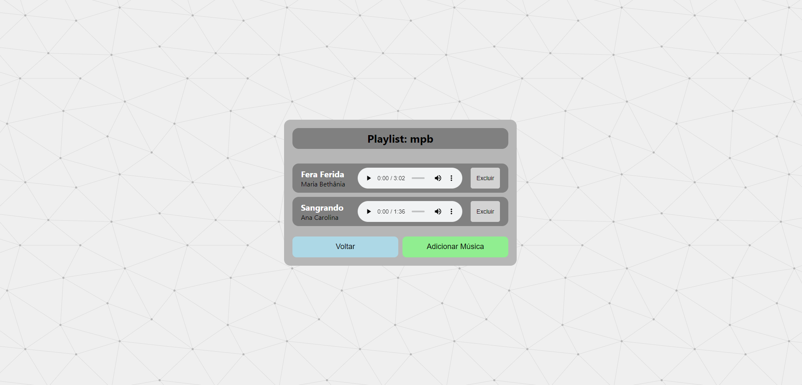
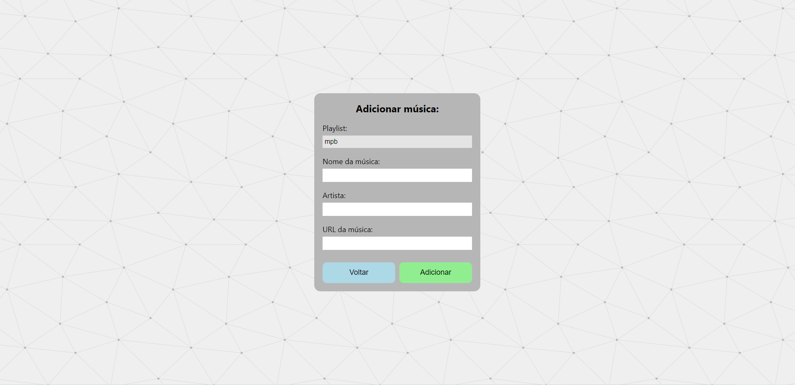
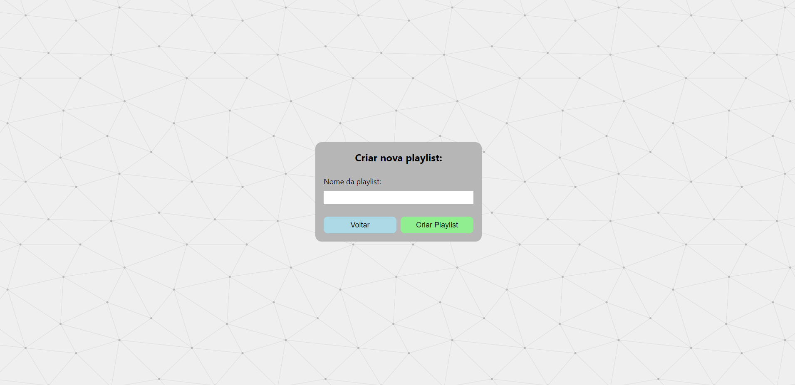

# `Projeto`
Projeto Labefy

# `Link`
[Clique aqui!](http://folletto-labefy.surge.sh/)

# `Descrição`
O Projeto Labefy foi desenvolvido como uma atividade dentro do curso Full-Stack Web Developer da Labenu, o qual consiste em requisições para a API desenvolvida pela equipe da Labenu via axios.  
Os métodos utilizados para realizar este projeto foram:  
**- getAllPlaylists:** ver todas as playlists cadastradas.  
**- getPlaylistsTracks:** ver as músicas cadastradas em uma determinada playlists.  
**- createPlaylist:** criar uma nova playlist.  
**- addTrackToPlaylist:** adicionar uma nova música em uma determinada playlist.  
**- deletePlaylist:** deletar uma determinada playlist.  
**- removeTrackFromPlaylist:** deletar música de uma playlist.  
 
A documentação da API pode ser encontrada [aqui](https://documenter.getpostman.com/view/7549981/SztBc8eT?version=latest)

# `Modo de usar`
Ao iniciar a aplicação o usuário é direcionado para a tela de Home, onde existem dois botões:  
- Ao clicar no botão **Sobre**, o usuário é redirecionado para uma página que contém informações sobre o projeto;  
- Ao clicar no botão **Ver Playlists** o usuário é direcionado para uma página que contém uma lista com todas as playlists cadastradas, onde existem algumas opções de iteração para o usuário:  
  - ao clicar em **Excluir**, o usuário deleta aquela playlist da lista.  
-  : e Sobre. Ao clicar em Sobren. Nesta tela, o usuário pode efetuar seu login ou então se inscrever na plataforma, criando um usuário com nome, email, senha e dados de endereço.
 
Após efetuar login, o usuário é redirecionado para a página de feed, onde poderá escolher entre diferentes tipos de restaurantes, podendo filtrar por palavras chave (utilizando para o tal o campo de buscas) ou por tipos de comidas, na barra superior. Dentre as opções estão por exemplo comida Asiática, Hamburgueres, Italiana, Sorvetes entre outros.
 
Clicando sobre a imagem de um restaurante no feed, o usuário é redicionado para a página de detalhes detes, onde são listados todos os alimentos fornecidos pelo estabelecimento, podendo o usuário adicionar e remover produtos para o seu carrinho.
 
Na parte inferior existe um menu, onde o usuário pode acessar a página de carrinho e verificar todos os itens que adicionou ao mesmo, valor do frente e total da compra, além de selecionar um método de pagamento. Também é possível remover itens da lista. Ao clicar em confirmar, será exibida uma mensagem de pedido realizado com sucesso.
 
No menu inferior, o usuário pode clicar no ícone de perfil e então será redirecionado para a página de perfil do usuário, onde pode alterar seus dados cadastrais e de endereço, e ainda verificar o seu histórico de pedidos. No canto superior direito da página, é possível também fazer o logout da conta, sendo então redirecionado para a página de login.

# `Instalando e rodando o projeto`
Fazer o clone do projeto:
- git clone link-do-repositório

Instalar as dependências:
- npm install

Rodar o projeto:
- npm run start

# `Tecnologias utilizadas`

# `Autor`
Evandro Paulo Folletto
 
  
 

# `Imagens`
### Página Home

### Página Sobre

### Página playlists

### Página detalhes playlist

### Página adicionar música

### Página criar playlist

